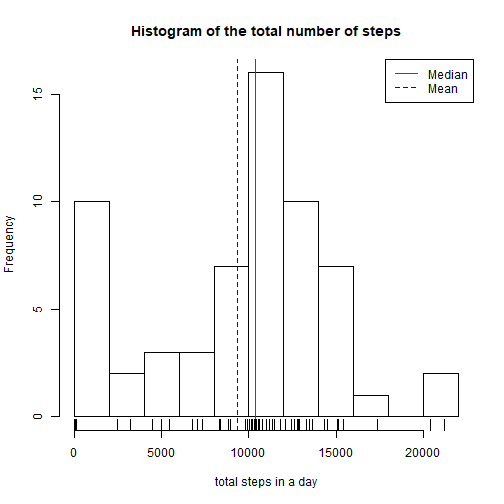
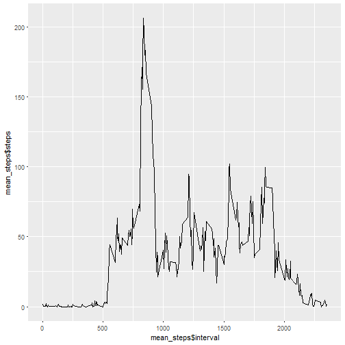
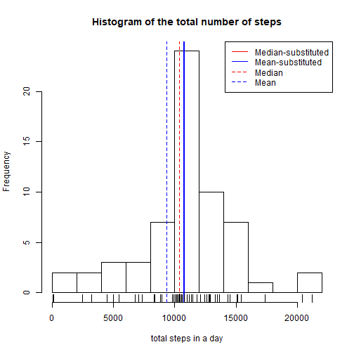
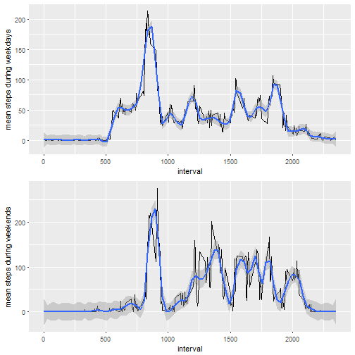

# Week 2 Peer Graded Assignment: Activity Monitoring.

This document corresponds to the assignment of [Week 2](https://www.coursera.org/learn/reproducible-research/peer/gYyPt/course-project-1) to analyse the activity levels [monitored in 5 min intervals](https://d396qusza40orc.cloudfront.net/repdata%2Fdata%2Factivity.zip).

### Loading and preprocessing the data
Next chunck of code reads the file *activity.csv* that should be in your WD and
creates a data frame. Loads the packages required through the assignment and transforms 
the date into the required format.


```r
library(ggplot2)
library(dplyr)
library(gridExtra)
activity<-read.csv("activity.csv")
activity$date<-as.Date(activity$date)
```

### What is mean total number of steps taken per day?
This section calculates the sum of steps each day, calculates mean and median and shows the histogram. It removes NA values.


```r
total_steps<-tapply(activity$steps,activity$date,sum,na.rm=TRUE)
sum(total_steps,na.rm=TRUE)
mean_daily<-mean(total_steps,na.rm=TRUE)
median_daily<-median(total_steps,na.rm=TRUE)
hist(total_steps,xlab="total steps in a day",main="Histogram of the total number of steps",breaks=8)
abline(v = median_daily, lwd = 1, lty = 1,col="red")
abline(v = mean_daily, lwd = 1, lty = 2,col="blue")
legend("topright", lty = c(1,2), col = c("red", "blue"), legend = c("Median", "Mean"))
rug(total_steps)
```



Mean number of steps per day is 9354.2295082 and the median of the distribution is 10395.

### What is the average daily activity pattern?
Next chunck creates a new data frame containing the mean for each interval, plots the evolution and provides the maximum mean. 

```r
mean_steps<-as.data.frame(activity$interval[1:288])
colnames(mean_steps)<-c("interval")
mean_steps$steps<-tapply(activity$steps,activity$interval,mean,na.rm=TRUE)
qplot(mean_steps$interval,mean_steps$steps,geom="line",na.rm=TRUE)
```



```r
max_mean_steps<-max(mean_steps$steps)
```

Maximum mean number of steps per interval is 206.1698113.

### Imputing missing values
In this section, the number of NA is calculated, and the NA values are substituted by the mean of that interval for the rest of the days. 


```r
total_na<-sum(is.na(activity$steps))
activity_noNA<-mutate(activity,stepsnoNA=activity$steps)
for (i in 1:17568) {
      if (is.na(activity_noNA$steps[i])==TRUE){activity_noNA$steps[i]=
         mean_steps$steps[match(activity_noNA$interval[i],mean_steps$interval)]   
      }

}
total_stepsnoNA<-tapply(activity_noNA$steps,activity_noNA$date,sum,na.rm=TRUE)

mean_dailynoNA<-mean(total_stepsnoNA,na.rm=TRUE)
median_dailynoNA<-median(total_stepsnoNA,na.rm=TRUE)

hist(total_stepsnoNA,xlab="total steps in a day",main="Histogram of the total number of steps",breaks=8)
abline(v = median_dailynoNA, lwd = 2, lty = 1,col="red")
abline(v = mean_dailynoNA, lwd = 2, lty = 1,col="blue")
abline(v = median_daily, lwd = 1, lty = 2,col="red")
abline(v = mean_daily, lwd = 1, lty = 2,col="blue")
legend("topright", lty = c(1,1,2,2), col = c("red", "blue","red", "blue"), legend = c("Median-substituted", "Mean-substituted","Median","Mean"))
rug(total_stepsnoNA)
```



Prior to the substitution there were `total_na` missing values. 

New values for mean and median are mean=1.0766189 &times; 10<sup>4</sup> and
median=1.0766189 &times; 10<sup>4</sup>. They are higher than the values before substitution:
mean= 9354.2295082 and median= 10395, since NA values have been substituted by 
values bigger than 0 (the mean of the value for the interval). Furthermore, after substituting NA values, mean and median are the same, since the days without data have been replaced by the mean of the rest of the days.

### Weekdays vs Weekend
Next section plots time evolution of the mean for weekdays and weekends.

```r
activity<-mutate(activity,weekday=weekdays(activity$date))
for (i in 1:17568){
      if(activity$weekday[i]=="dissabte"||activity$weekday=="diumenge"){
            activity$weekday[i]=FALSE
      } else {
            activity$weekday[i]=TRUE
      }
}

WD<-filter(activity,weekday=="TRUE")
WE<-filter(activity,weekday=="FALSE")
mean_steps$weekday<-tapply(WD$steps,WD$interval,mean,na.rm=TRUE)
mean_steps$weekend<-tapply(WE$steps,WE$interval,mean,na.rm=TRUE)
par(mfrow = c(2, 1))
p1<-qplot(mean_steps$interval,mean_steps$weekday,geom="line",na.rm=TRUE,xlab="interval",ylab="mean steps during weekdays")+geom_smooth(span=0.08)#+geom_point(aes(WE$interval,WE$steps)) 
p2<-qplot(mean_steps$interval,mean_steps$weekend,geom="line",na.rm=TRUE,xlab="interval",ylab="mean steps during weekends")+geom_smooth(span=0.08)
grid.arrange(p1,p2)
```

```
## `geom_smooth()` using method = 'loess'
## `geom_smooth()` using method = 'loess'
```



Comparing weekdays and weekends, weekdays show a slightly larger activity at low intervals (around 600, suggesting getting up earlier),while the activity at the 1200-2000 interval is larger during weekends. Also, activity ends later (suggesting going to bed later).

